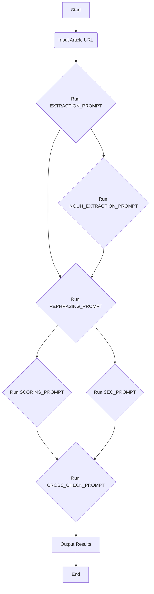

This is a [Next.js](https://nextjs.org) project bootstrapped with [`create-next-app`](https://nextjs.org/docs/app/api-reference/cli/create-next-app).

## Getting Started

First, run the development server:

```bash
npm run dev
# or
yarn dev
# or
pnpm dev
# or
bun dev
```

Open [http://localhost:3000](http://localhost:3000) with your browser to see the result.

You can start editing the page by modifying `app/page.tsx`. The page auto-updates as you edit the file.

This project uses [`next/font`](https://nextjs.org/docs/app/building-your-application/optimizing/fonts) to automatically optimize and load [Geist](https://vercel.com/font), a new font family for Vercel.

## Learn More

To learn more about Next.js, take a look at the following resources:

- [Next.js Documentation](https://nextjs.org/docs) - learn about Next.js features and API.
- [Learn Next.js](https://nextjs.org/learn) - an interactive Next.js tutorial.

You can check out [the Next.js GitHub repository](https://github.com/vercel/next.js) - your feedback and contributions are welcome!

## Deploy on Vercel

The easiest way to deploy your Next.js app is to use the [Vercel Platform](https://vercel.com/new?utm_medium=default-template&filter=next.js&utm_source=create-next-app&utm_campaign=create-next-app-readme) from the creators of Next.js.

Check out our [Next.js deployment documentation](https://nextjs.org/docs/app/building-your-application/deploying) for more details.

## News Article Processing Workflow

This project implements a multi-step workflow for processing news articles using a series of AI models and prompts. The primary goal is to automatically extract key information, rephrase the content into a publication-ready format, evaluate the quality, generate SEO metadata, and cross-check the consistency of the outputs.

The workflow is orchestrated by the `test.js` script, which defines the sequence of operations and the specific prompts used for each stage.

### Workflow Steps

The process follows a linear sequence:

1.  **Extract Key Information:** The initial step uses the `EXTRACTION_PROMPT` to analyze the raw article content and extract core details based on the UNIVERSAL CONTENT PROCESSING FRAMEWORK (UCPFv1.0). This involves input normalization, structural and semantic analysis, and metadata isolation. The output is a structured representation of the key information from the article.

2.  **Extract Proper Nouns:** This step utilizes the `NOUN_EXTRACTION_PROMPT` based on the UNIVERSAL ENTITY RECOGNITION FRAMEWORK (UERFv2.0). It performs a pattern-agnostic linguistic decoding to identify and classify proper nouns and other entities within the article content. This provides a list of recognized entities with associated metadata.

3.  **Rephrase the Article:** Using the `REPHRASING_PROMPT`, the extracted key information and the original article URL are fed to an AI editorial assistant. This assistant transforms the raw content into a polished, publication-ready article adhering to AP Style guidelines and optimized for digital consumption. The output is the rephrased article.

4.  **Score the Rephrased Article:** The `SCORING_PROMPT` defines criteria for evaluating the quality of the rephrased article. An AI judge panel scores the article based on accuracy, clarity, engagement, professionalism, and completeness. The output includes individual scores for each criterion, a total score, and suggestions for improvement if the total score is below 80.

5.  **Generate SEO Metadata:** The `SEO_PROMPT` is used to generate relevant SEO metadata for the rephrased article. This includes keywords, a meta description, hashtags, and a suggested SEO-friendly title, all based on the extracted details and the rephrased content.

6.  **Cross-check All Outputs:** The final step employs the `CROSS_CHECK_PROMPT` to verify the consistency across all generated outputs. An AI assistant checks if the extracted details match the original context, if the rephrased article accurately reflects the details, if the scoring is consistent, and if the SEO metadata aligns with the content. It reports any inconsistencies or confirms successful validation.

### Workflow Diagram

The following Mermaid diagram illustrates the flow of information and processes:



This workflow ensures a structured and automated approach to transforming raw news content into high-quality, optimized articles with associated metadata and quality checks.
